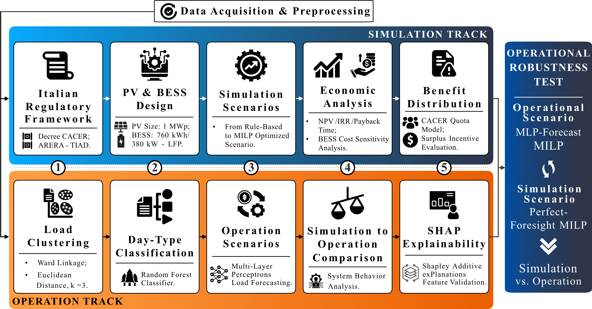

# Methodology and code map

This page explains how the methodology of the paper is implemented, step by step, and where every equation, table,
and figure of the paper is computed. Section, equation, table, and figure numbers refer to the revised manuscript.

The methodology has two tracks that start from the same metered data (Fig. 1). The **simulation track** applies the
Italian regulatory framework, designs the PV plant and the BESS, simulates four dispatch strategies, and evaluates
their financial performance and the allocation of the benefits among the members. The **operation track**
characterizes the residential demand through clustering and classification, forecasts it with a machine-learning
model, and measures how much of the design-stage revenue survives when the dispatch is planned on forecasts and
applied open-loop to the measured loads.

## Pipeline steps

| Step | Module | Paper | Outputs |
|---|---|---|---|
| 0 | `data.py` | Sections 2.1, 3.1 | validated input series on the two calendars |
| 1 | `design.py` | Sections 2.1–2.3, 3.2, 4.1, 4.2 | `results/results_design.json`, `loads_chrono.npz`, `milp_year.npz` |
| 2 | `clustering.py` | Section 2.4, 4.3 | `results/results_clustering.json`, `clusters.npz` |
| 3 | `operation.py` | Sections 2.4, 2.5, 4.3, 4.4 | `results/results_ops.json`, `forecast.npz`, `plan_A/B/C.npz` |
| 4 | `extras.py` | Sections 2.2, 4.3, 4.4, 5.3 | `results/extra.json` |
| 5 | `figures.py` | Figs. 2–10 | `figures/*.png`, `figures/*.pdf`, `results/critical_week.json` |

Shared components: `config.py` (all parameters), `models.py` (dispatch models and economics), `forecasting.py`
(inputs and network of the forecaster), `synthetic.py` (synthetic stand-in for the confidential data). The `.npz`
files are hourly intermediate outputs used by the figures; they are not distributed because they contain, or are
derived from, the metered loads.

### Step 0 – Input data (`data.py`)

- Reads and validates the public and confidential files described in [`data/README.md`](../data/README.md).
- Interpolates the hour skipped by the daylight-saving change (2025-03-30 02:00), which the meters store as zero.
- Maps the measurement campaign (October 2024 – September 2025) onto the simulated year 2025, preserving the day of
  the week (Section 3.1).
- Computes the incentive tariff of the CACER Decree for plants above 600 kW in southern Italy,
  TIP = min(100, 60 + max(0, 180 − P_zone)) €/MWh (Eq. 2).

### Step 1 – Design-stage analysis (`design.py`)

| Paper | Implementation |
|---|---|
| Eq. 1 – shared energy as min(injection, withdrawal) | `models.econ` |
| Eq. 3 – hourly economic value (incentive and ARERA valorization on the shared energy, RID on the whole injection) | `models.econ` |
| Eqs. 4–5 – rule-based self-consumption | `models.rule(mode="sc")` |
| Eqs. 6–7 – price-driven arbitrage (125 €/MWh at any hour, 85 €/MWh from 18:00) | `models.rule(mode="arb")` |
| Eqs. 8–17 – MILP (objective, energy balance, shared-energy bounds, SOC dynamics and window, binary charge/discharge exclusivity, no grid charging) | `models.milp` (PuLP + CBC) |
| Table 3 – monthly synthesis of the PV generation | `R["table1"]` |
| Table 4 – shared energy and gross revenue by scenario | `R["scenarios"]` |
| Eq. 45, Table 5 – virtual self-consumption by user category | `R["scenarios"][*]["vsc"]` |
| Eqs. 18–20 – NPV, discounted payback period, IRR | `design.run.dcf` |
| Eqs. 21–22 – PV degradation and linear capacity fade of the battery; the dispatch is recomputed for each of the 20 years | `design.run.yearly_rid` |
| Table 6, Fig. 5 – financial indicators and discounted cash flow | `R["dcf"]` |
| Fig. 6 – sensitivity to the BESS cost (150–550 €/kWh) and break-even cost | `R["sens"]`, `R["breakeven_cost"]` |
| Eqs. 23–31, Table 7 – three-phase CACER allocation with the 55% threshold | `R["alloc"]` |
| Eq. 46 – shared-to-injected energy ratio | `R["scenarios"][*]["rho"]` |

The MILP has 52 560 variables (8760 binary) and 52 560 constraints for the annual horizon and is solved to
optimality by CBC in a few seconds; `R["milp_checks"]` verifies, over the 8760 hours, that the shared energy returned
by the solver equals the hourly minimum of Eq. 1 and that charging and discharging never occur in the same hour.

### Step 2 – Clustering and day-type classification (`clustering.py`)

| Paper | Implementation |
|---|---|
| Daily profiles normalized by their maximum, hierarchical clustering with Ward linkage and Euclidean distance | `clustering.run` |
| Eqs. 43–44 – Silhouette and Davies–Bouldin indices for k = 3–15 | `R["validity"]` |
| Fig. 7 – three demand archetypes and intra-cluster RMSE | `R["clusters"]`, `figures.py` |
| Eq. 32 – random forest (100 trees, minimum 5 samples per leaf, 80/20 random split of the days) on daily temperatures and day of the week | `R["classifier"]` |
| End-to-end RMSE between the real profile and the centroid of the predicted class | `R["classifier"]["end_to_end_rmse"]` |
| Table 8 – Gini importance of the classifier features | `R["feature_importance"]` |

The clustering and the classifier characterize the residential demand; their output does not enter the forecast that
drives the dispatch.

### Step 3 – Forecaster and EMS robustness test (`operation.py`, `forecasting.py`)

| Paper | Implementation |
|---|---|
| Eqs. 34–37 – day-ahead inputs: cyclic hour and day of the week, non-working-day indicator, outdoor temperature and its change over 24 h, load 24, 48, and 168 h before normalized by the mean load of the previous day; target: ratio to the previous-day mean | `forecasting.build` |
| Eq. 38 – MLP 10-256-128-64-1, ReLU, Adam, L2 penalty 1e-3, early stopping | `forecasting.make_mlp` |
| Rolling-origin validation with expanding window and monthly retraining (January–September 2025 out-of-sample) | `operation.run` |
| Eqs. 39–41 – R², RMSE, MAPE; naive benchmarks (previous day, previous week) | `R["mlp_oos"]`, `R["naive24_res_oos"]`, `R["naive_res_oos"]` |
| Eq. 42 – peak-timing error | `R["peak_timing"]`, `R["peak_timing_evening"]` |
| Eq. 33, Table 9, Fig. 9 – out-of-sample kernel SHAP (306 hours) in kWh of community demand | `R["shap"]` |
| Section 2.5, Table 10 – perfect-foresight MILP vs forecast-based plans applied open-loop to the measured loads (A: residential forecast, non-residential measured; B: all users forecast; C: seasonal-naive forecast for all users) | `R["pf"]`, `R["plans"]` |
| Share of hours in which the shared energy is bounded by the injection | `R["pf_demand_limited"]` |

### Step 4 – Complementary quantities (`extras.py`)

Random 70/30 split of the hourly samples with the same forecaster (optimistic benchmark), solve time of the 24-hour
MILP of a receding-horizon implementation, revenue gap of the critical week of August, present value of the RID
increment of MILP against the additional cost of the battery, and statistics of the zonal prices behind the arbitrage
thresholds.

### Step 5 – Figures (`figures.py`)

| File | Paper |
|---|---|
| `Fig01_Methodological_Framework.png` | Fig. 1 (drawing, not generated by the code) |
| `Fig02_Seasonal_Load_Profiles` | Fig. 2 |
| `Fig03_MILP_Operational_Heatmaps` | Fig. 3 |
| `Fig04_Typical_Daily_Profiles` | Fig. 4 |
| `Fig05_Discounted_Cash_Flow` | Fig. 5 |
| `Fig06_BESS_Cost_Sensitivity` | Fig. 6 |
| `Fig07_Demand_Archetypes` | Fig. 7 |
| `Fig08_Rolling_Origin_Forecast` | Fig. 8 |
| `Fig09_SHAP_Summary` | Fig. 9 |
| `Fig10_Critical_Week` | Fig. 10 |

Every figure is saved as PNG and as vector PDF at 500 dpi.

## Modeling choices worth knowing

- **Virtual model.** The shared energy is computed ex post as the hourly minimum between injection and withdrawal of
  the whole configuration, and the RID remunerates all the injected energy; no physical self-consumption is assumed.
- **No grid charging.** The battery is charged only by the PV plant (Eq. 17), in line with the TIAD.
- **Open-loop operation.** The forecast-based plan is computed once over the out-of-sample period and applied without
  re-optimization; the physical SOC limits are enforced during the realization (`models.realize`).
- **Degradation.** The PV output decreases by 0.5% per year; the usable capacity of the battery decreases linearly with
  the cumulative throughput, reaching 80% at 8000 equivalent full cycles. Degradation enters the DCF but not the
  dispatch objective.
- **Weather.** The forecaster uses the measured outdoor temperature, which corresponds to a perfect weather forecast.
